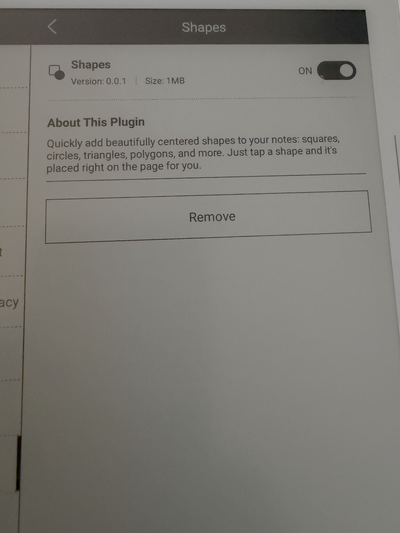
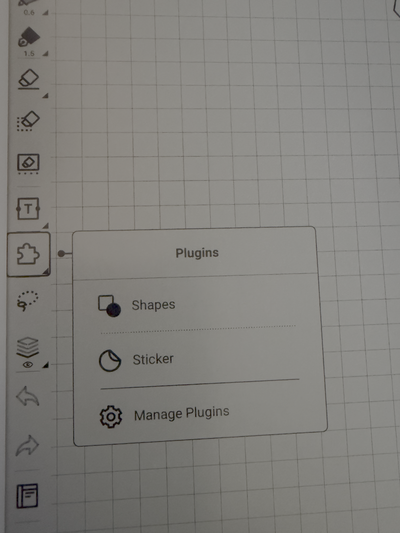
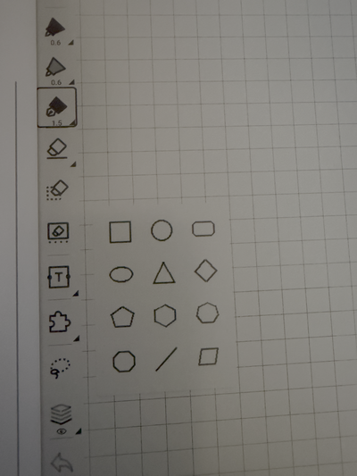

# Shapes Plugin for Supernote


A toolbar plugin for Supernote that lets you insert geometric shapes directly into your notes.

## Screenshots

| Plugin Info | Plugin Menu | Shape Palette |
|:-----------:|:-----------:|:-------------:|
|  |  |  |
| Manage installation and view details | Access Shapes from the Plugins panel | Tap a shape to insert it on the page |

## Available Shapes

Square, Circle, Rounded Rectangle, Ellipse, Triangle, Diamond, Pentagon, Hexagon, Heptagon, Octagon, Line, and Parallelogram.

## How to Use

1. Open a note on your Supernote.
2. Tap the **Plugins** icon in the left toolbar (the puzzle piece).
3. Tap **Shapes** to open the shape palette.
4. Tap any shape to insert it centered on the current page.
5. The palette closes automatically. To dismiss without inserting, tap anywhere outside the panel.

## Building

Make sure you have Node.js 18+ installed, then:

```sh
npm install
./buildPlugin.sh
```

This produces `build/outputs/SnShapes.snplg`.

## Installing on the Device

Use the Supernote Partner App to copy `build/outputs/SnShapes.snplg` to the `MyStyles` folder on your device. Then on the Supernote, navigate to `Settings -> Apps -> Plugins -> Add Plugin` to add the plugin to your supernote.

## Running Tests

```sh
npm test
```

## Linting

```sh
npm run lint
```

## Project Structure

```
src/
  shapes.ts         Shape definitions and geometry helpers
  ShapePalette.tsx   UI component (palette grid, insertion logic)
assets/
  icon.png           Toolbar icon
  shapes/            Shape thumbnail images
docs/
  images/            Screenshots from the device
index.js             Plugin entry point (toolbar button registration)
App.tsx              React Native root component
```

---

Hope you enjoy using this plugin as much as I enjoyed developing it. If you find any issues, please feel free to raise an [Issue](https://github.com/j-raghavan/sn-shapes/issues).

